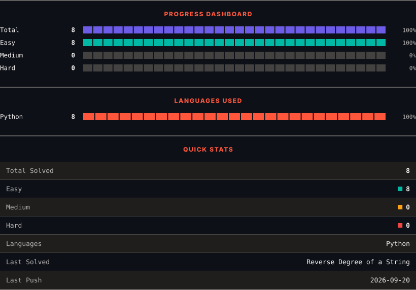
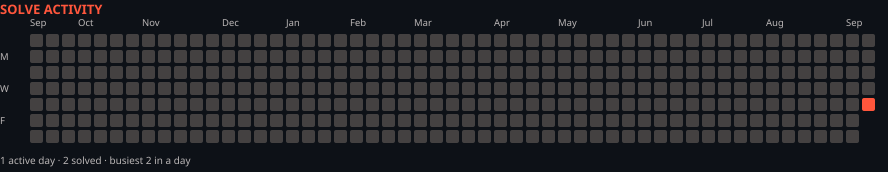

<h1>LeetCode Solutions</h1>

<em>Automatically synced with every accepted submission</em>

   

<picture>
  <source media="(prefers-color-scheme: dark)" srcset=".leetsync/stats-dark.svg">
  <source media="(prefers-color-scheme: light)" srcset=".leetsync/stats-light.svg">
  
</picture>

<picture>
  <source media="(prefers-color-scheme: dark)" srcset=".leetsync/calendar-dark.svg">
  <source media="(prefers-color-scheme: light)" srcset=".leetsync/calendar-light.svg">
  
</picture>

---

### ALL SOLUTIONS

| # | Problem | Difficulty | Language | Date |
|:---:|:--------|:----------:|:--------:|:----:|
| 69 | [Sqrt(x)](problems/0069-Sqrtx) | 🟩 Easy | `Python` | 2026-09-22 |
| 231 | [Power of Two](problems/0231-Power-of-Two) | 🟩 Easy | `Python` | 2026-09-21 |
| 263 | [Ugly Number](problems/0263-Ugly-Number) | 🟩 Easy | `Python` | 2026-09-21 |
| 342 | [Power of Four](problems/0342-Power-of-Four) | 🟩 Easy | `Python` | 2026-09-22 |
| 383 | [Ransom Note](problems/0383-Ransom-Note) | 🟩 Easy | `Python` | 2026-09-18 |
| 507 | [Perfect Number](problems/0507-Perfect-Number) | 🟩 Easy | `Python` | 2026-09-17 |
| 771 | [Jewels and Stones](problems/0771-Jewels-and-Stones) | 🟩 Easy | `Python` | 2026-09-17 |
| 1108 | [Defanging an IP Address](problems/1108-Defanging-an-IP-Address) | 🟩 Easy | `Python` | 2026-09-18 |
| 1281 | [Subtract the Product and Sum of Digits of an Integer](problems/1281-Subtract-the-Product-and-Sum-of-Digits-of-an-Integer) | 🟩 Easy | `Python` | 2026-09-18 |
| 1512 | [Number of Good Pairs](problems/1512-Number-of-Good-Pairs) | 🟩 Easy | `Python` | 2026-09-18 |
| 1678 | [Goal Parser Interpretation](problems/1678-Goal-Parser-Interpretation) | 🟩 Easy | `Python` | 2026-09-18 |
| 3498 | [Reverse Degree of a String](problems/3498-Reverse-Degree-of-a-String) | 🟩 Easy | `Python` | 2026-09-20 |

---

Auto-synced by <strong>LeetSync</strong> · Built by <a href="https://deveshsamant.in/">Devesh Samant</a>

