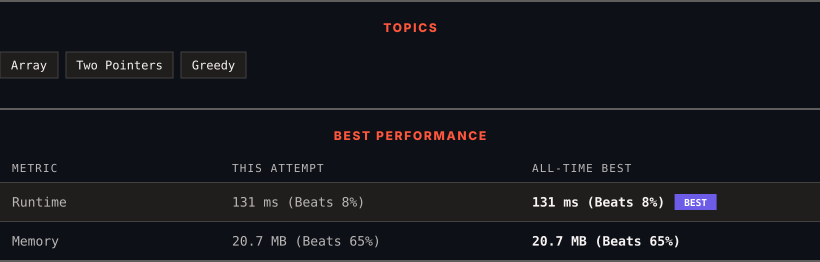

<div align="center">

# 11. Container With Most Water

      

[](https://leetcode.com/problems/container-with-most-water/)

</div>

---

<div align="center">

<picture>
  <source media="(prefers-color-scheme: dark)" srcset="panel-dark.svg">
  <source media="(prefers-color-scheme: light)" srcset="panel-light.svg">
  
</picture>

</div>

> **New personal best** — Runtime improved on this submission.

### HOW IT WENT

| | |
|:--|:--|
| **Attempts** | 2 before accepted |
| **Time to solve** | 15 min |
| **Verdicts** | ❌ Wrong Answer → ✅ Accepted |

---

### NOTES

_No notes yet._

---

### SOLUTIONS (1)

| # | File | Language | Date |
|:-:|------|:--------:|:----:|
| 1 | [sol1.py](./sol1.py) | `Python` | 2026-10-07 ← **latest** |

---

### PROBLEM DESCRIPTION

You are given an integer array `height` of length `n`. There are `n` vertical lines drawn such that the two endpoints of the `i^th` line are `(i, 0)` and `(i, height[i])`.

Find two lines that together with the x-axis form a container, such that the container contains the most water.

Return *the maximum amount of water a container can store*.

**Notice** that you may not slant the container.

 

**Example 1:**


```

**Input:** height = [1,8,6,2,5,4,8,3,7]
**Output:** 49
**Explanation:** The above vertical lines are represented by array [1,8,6,2,5,4,8,3,7]. In this case, the max area of water (blue section) the container can contain is 49.

```

**Example 2:**

```

**Input:** height = [1,1]
**Output:** 1

```

 

**Constraints:**

	- `n == height.length`

	- `2 <= n <= 10^5`

	- `0 <= height[i] <= 10^4`

---

<div align="center">

<sub>Auto-synced by <strong>LeetSync</strong> · Built by <a href="https://deveshsamant.in/">Devesh Samant</a></sub>

</div>
