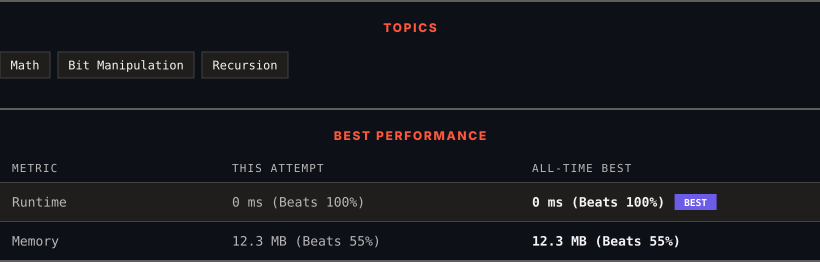

<div align="center">

# 231. Power of Two

      

[](https://leetcode.com/problems/power-of-two/)

</div>

---

<div align="center">

<picture>
  <source media="(prefers-color-scheme: dark)" srcset="panel-dark.svg">
  <source media="(prefers-color-scheme: light)" srcset="panel-light.svg">
  
</picture>

</div>

> **New personal best** — Runtime improved on this submission.

### HOW IT WENT

| | |
|:--|:--|
| **Attempts** | 2 before accepted |
| **Time to solve** | 4 min |
| **Verdicts** | ❌ Wrong Answer → ✅ Accepted |

---

### NOTES

_No notes yet._

---

### SOLUTIONS (1)

| # | File | Language | Date |
|:-:|------|:--------:|:----:|
| 1 | [sol1.py](./sol1.py) | `Python` | 2026-09-21 ← **latest** |

---

### PROBLEM DESCRIPTION

Given an integer `n`, return *`true` if it is a power of two. Otherwise, return `false`*.

An integer `n` is a power of two, if there exists an integer `x` such that `n == 2^x`.

 

**Example 1:**

```

**Input:** n = 1
**Output:** true
**Explanation: **2^0 = 1

```

**Example 2:**

```

**Input:** n = 16
**Output:** true
**Explanation: **2^4 = 16

```

**Example 3:**

```

**Input:** n = 3
**Output:** false

```

 

**Constraints:**

	- `-2^31 <= n <= 2^31 - 1`

 

**Follow up:** Could you solve it without loops/recursion?

---

<div align="center">

<sub>Auto-synced by <strong>LeetSync</strong> · Built by <a href="https://deveshsamant.in/">Devesh Samant</a></sub>

</div>
