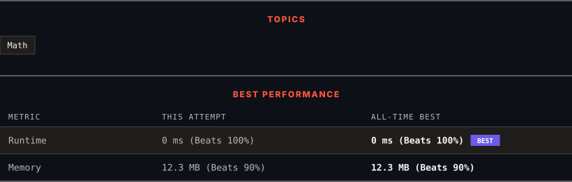

<div align="center">

# 263. Ugly Number

      

[](https://leetcode.com/problems/ugly-number/)

</div>

---

<div align="center">

<picture>
  <source media="(prefers-color-scheme: dark)" srcset="panel-dark.svg">
  <source media="(prefers-color-scheme: light)" srcset="panel-light.svg">
  
</picture>

</div>

> **New personal best** — Runtime improved on this submission.

### HOW IT WENT

| | |
|:--|:--|
| **Attempts** | first try |
| **Time to solve** | 9 min |
| **Verdicts** | ✅ Accepted |

---

### NOTES

_No notes yet._

---

### SOLUTIONS (1)

| # | File | Language | Date |
|:-:|------|:--------:|:----:|
| 1 | [sol1.py](./sol1.py) | `Python` | 2026-09-21 ← **latest** |

---

### PROBLEM DESCRIPTION

An **ugly number** is a *positive* integer which does not have a prime factor other than 2, 3, and 5.

Given an integer `n`, return `true` *if* `n` *is an **ugly number***.

 

**Example 1:**

```

**Input:** n = 6
**Output:** true
**Explanation:** 6 = 2 × 3

```

**Example 2:**

```

**Input:** n = 1
**Output:** true
**Explanation:** 1 has no prime factors.

```

**Example 3:**

```

**Input:** n = 14
**Output:** false
**Explanation:** 14 is not ugly since it includes the prime factor 7.

```

 

**Constraints:**

	- `-2^31 <= n <= 2^31 - 1`

---

<div align="center">

<sub>Auto-synced by <strong>LeetSync</strong> · Built by <a href="https://deveshsamant.in/">Devesh Samant</a></sub>

</div>
