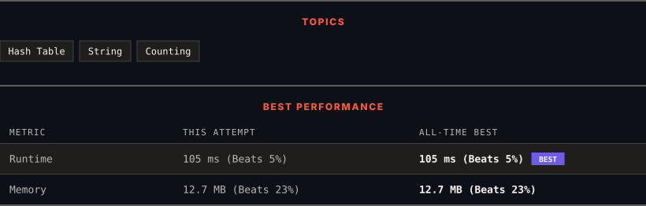

<div align="center">

# 383. Ransom Note

      

[](https://leetcode.com/problems/ransom-note/)

</div>

---

<div align="center">

<picture>
  <source media="(prefers-color-scheme: dark)" srcset="panel-dark.svg">
  <source media="(prefers-color-scheme: light)" srcset="panel-light.svg">
  
</picture>

</div>

> **New personal best** — Runtime improved on this submission.

### HOW IT WENT

| | |
|:--|:--|
| **Attempts** | 4 before accepted |
| **Time to solve** | 22 h 47 min |
| **Verdicts** | ❌ Wrong Answer → ✅ Accepted → 📤 Output Limit Exceeded → ✅ Accepted |

---

### NOTES

_No notes yet._

---

### SOLUTIONS (2)

| # | File | Language | Date |
|:-:|------|:--------:|:----:|
| 1 | [sol1.py](./sol1.py) | `Python` | 2026-09-18 |
| 2 | [sol2.py](./sol2.py) | `Python` | 2026-09-18 ← **latest** |

---

### PROBLEM DESCRIPTION

Given two strings `ransomNote` and `magazine`, return `true`* if *`ransomNote`* can be constructed by using the letters from *`magazine`* and *`false`* otherwise*.

Each letter in `magazine` can only be used once in `ransomNote`.

 

**Example 1:**

```
**Input:** ransomNote = "a", magazine = "b"
**Output:** false

```

**Example 2:**

```
**Input:** ransomNote = "aa", magazine = "ab"
**Output:** false

```

**Example 3:**

```
**Input:** ransomNote = "aa", magazine = "aab"
**Output:** true

```

 

**Constraints:**

	- `1 <= ransomNote.length, magazine.length <= 10^5`

	- `ransomNote` and `magazine` consist of lowercase English letters.

---

<div align="center">

<sub>Auto-synced by <strong>LeetSync</strong> · Built by <a href="https://deveshsamant.in/">Devesh Samant</a></sub>

</div>
