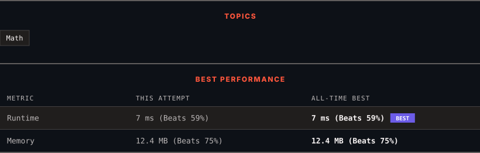

<div align="center">

# 507. Perfect Number

      

[](https://leetcode.com/problems/perfect-number/)

</div>

---

<div align="center">

<picture>
  <source media="(prefers-color-scheme: dark)" srcset="panel-dark.svg">
  <source media="(prefers-color-scheme: light)" srcset="panel-light.svg">
  
</picture>

</div>

> **New personal best** — Runtime improved on this submission.

### HOW IT WENT

| | |
|:--|:--|
| **Attempts** | 2 before accepted |
| **Time to solve** | 4 min |
| **Verdicts** | 💾 Memory Limit Exceeded → ✅ Accepted |

---

### NOTES

_No notes yet._

---

### SOLUTIONS (1)

| # | File | Language | Date |
|:-:|------|:--------:|:----:|
| 1 | [sol1.py](./sol1.py) | `Python` | 2026-09-17 ← **latest** |

---

### PROBLEM DESCRIPTION

A [**perfect number**](https://en.wikipedia.org/wiki/Perfect_number) is a **positive integer** that is equal to the sum of its **positive divisors**, excluding the number itself. A **divisor** of an integer `x` is an integer that can divide `x` evenly.

Given an integer `n`, return `true`* if *`n`* is a perfect number, otherwise return *`false`.

 

**Example 1:**

```

**Input:** num = 28
**Output:** true
**Explanation:** 28 = 1 + 2 + 4 + 7 + 14
1, 2, 4, 7, and 14 are all divisors of 28.

```

**Example 2:**

```

**Input:** num = 7
**Output:** false

```

 

**Constraints:**

	- `1 <= num <= 10^8`

---

<div align="center">

<sub>Auto-synced by <strong>LeetSync</strong> · Built by <a href="https://deveshsamant.in/">Devesh Samant</a></sub>

</div>
