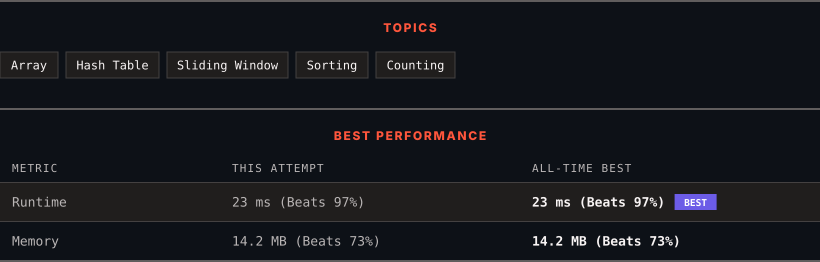

# 594. Longest Harmonious Subsequence

      

---

<picture>
  <source media="(prefers-color-scheme: dark)" srcset="panel-dark.svg">
  <source media="(prefers-color-scheme: light)" srcset="panel-light.svg">
  
</picture>

> **New personal best** — Runtime improved on this submission.

### HOW IT WENT

| | |
|:--|:--|
| **Attempts** | first try |
| **Time to solve** | 20 min |
| **Verdicts** | ✅ Accepted |

---

### NOTES

_No notes yet._

---

### SOLUTIONS (1)

| # | File | Language | Date |
|:-:|------|:--------:|:----:|
| 1 | [sol1.py](./sol1.py) | `Python` | 2026-09-28 ← **latest** |

---

### PROBLEM DESCRIPTION

We define a harmonious array as an array where the difference between its maximum value and its minimum value is **exactly** `1`.

Given an integer array `nums`, return the length of its longest harmonious subsequence among all its possible subsequences.

 

**Example 1:**

**Input:** nums = [1,3,2,2,5,2,3,7]

**Output:** 5

**Explanation:**

The longest harmonious subsequence is `[3,2,2,2,3]`.

**Example 2:**

**Input:** nums = [1,2,3,4]

**Output:** 2

**Explanation:**

The longest harmonious subsequences are `[1,2]`, `[2,3]`, and `[3,4]`, all of which have a length of 2.

**Example 3:**

**Input:** nums = [1,1,1,1]

**Output:** 0

**Explanation:**

No harmonic subsequence exists.

 

**Constraints:**

	- `1 <= nums.length <= 2 * 10^4`

	- `-10^9 <= nums[i] <= 10^9`

---

Auto-synced by <strong>LeetSync</strong> · Built by <a href="https://deveshsamant.in/">Devesh Samant</a>

