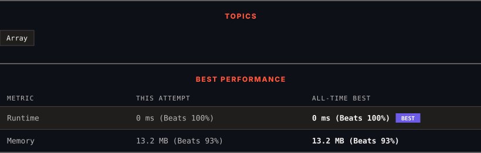

<div align="center">

# 674. Longest Continuous Increasing Subsequence

      

[](https://leetcode.com/problems/longest-continuous-increasing-subsequence/)

</div>

---

<div align="center">

<picture>
  <source media="(prefers-color-scheme: dark)" srcset="panel-dark.svg">
  <source media="(prefers-color-scheme: light)" srcset="panel-light.svg">
  
</picture>

</div>

> **New personal best** — Runtime improved on this submission.

### HOW IT WENT

| | |
|:--|:--|
| **Attempts** | 4 before accepted |
| **Time to solve** | 19 min |
| **Verdicts** | ❌ Wrong Answer → ❌ Wrong Answer → ❌ Wrong Answer → ✅ Accepted |

---

### NOTES

_No notes yet._

---

### SOLUTIONS (1)

| # | File | Language | Date |
|:-:|------|:--------:|:----:|
| 1 | [sol1.py](./sol1.py) | `Python` | 2026-09-28 ← **latest** |

---

### PROBLEM DESCRIPTION

Given an unsorted array of integers `nums`, return *the length of the longest **continuous increasing subsequence** (i.e. subarray)*. The subsequence must be **strictly** increasing.

A **continuous increasing subsequence** is defined by two indices `l` and `r` (`l < r`) such that it is `[nums[l], nums[l + 1], ..., nums[r - 1], nums[r]]` and for each `l <= i < r`, `nums[i] < nums[i + 1]`.

 

**Example 1:**

```

**Input:** nums = [1,3,5,4,7]
**Output:** 3
**Explanation:** The longest continuous increasing subsequence is [1,3,5] with length 3.
Even though [1,3,5,7] is an increasing subsequence, it is not continuous as elements 5 and 7 are separated by element
4.

```

**Example 2:**

```

**Input:** nums = [2,2,2,2,2]
**Output:** 1
**Explanation:** The longest continuous increasing subsequence is [2] with length 1. Note that it must be strictly
increasing.

```

 

**Constraints:**

	- `1 <= nums.length <= 10^4`

	- `-10^9 <= nums[i] <= 10^9`

---

<div align="center">

<sub>Auto-synced by <strong>LeetSync</strong> · Built by <a href="https://deveshsamant.in/">Devesh Samant</a></sub>

</div>
