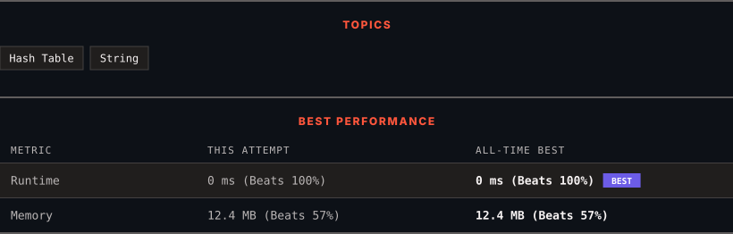

<div align="center">

# 771. Jewels and Stones

      

[](https://leetcode.com/problems/jewels-and-stones/)

</div>

---

<div align="center">

<picture>
  <source media="(prefers-color-scheme: dark)" srcset="panel-dark.svg">
  <source media="(prefers-color-scheme: light)" srcset="panel-light.svg">
  
</picture>

</div>

> **New personal best** — Runtime improved on this submission.

### HOW IT WENT

| | |
|:--|:--|
| **Attempts** | 2 before accepted |
| **Time to solve** | 10 min |
| **Verdicts** | ✅ Accepted → ✅ Accepted |

---

### NOTES

_No notes yet._

---

### SOLUTIONS (1)

| # | File | Language | Date |
|:-:|------|:--------:|:----:|
| 1 | [sol1.py](./sol1.py) | `Python` | 2026-09-17 ← **latest** |

---

### PROBLEM DESCRIPTION

You're given strings `jewels` representing the types of stones that are jewels, and `stones` representing the stones you have. Each character in `stones` is a type of stone you have. You want to know how many of the stones you have are also jewels.

Letters are case sensitive, so `"a"` is considered a different type of stone from `"A"`.

 

**Example 1:**

```
**Input:** jewels = "aA", stones = "aAAbbbb"
**Output:** 3

```

**Example 2:**

```
**Input:** jewels = "z", stones = "ZZ"
**Output:** 0

```

 

**Constraints:**

	- `1 <= jewels.length, stones.length <= 50`

	- `jewels` and `stones` consist of only English letters.

	- All the characters of `jewels` are **unique**.

---

<div align="center">

<sub>Auto-synced by <strong>LeetSync</strong> · Built by <a href="https://deveshsamant.in/">Devesh Samant</a></sub>

</div>
