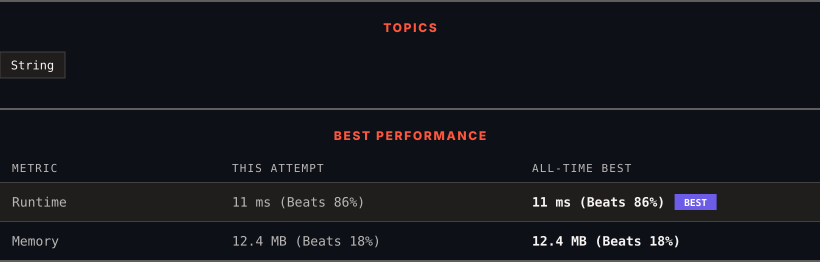

<div align="center">

# 1108. Defanging an IP Address

      

[](https://leetcode.com/problems/defanging-an-ip-address/)

</div>

---

<div align="center">

<picture>
  <source media="(prefers-color-scheme: dark)" srcset="panel-dark.svg">
  <source media="(prefers-color-scheme: light)" srcset="panel-light.svg">
  
</picture>

</div>

> **New personal best** — Runtime improved on this submission.

### HOW IT WENT

| | |
|:--|:--|
| **Attempts** | first try |
| **Time to solve** | 2 min |
| **Verdicts** | ✅ Accepted |

---

### NOTES

_No notes yet._

---

### SOLUTIONS (1)

| # | File | Language | Date |
|:-:|------|:--------:|:----:|
| 1 | [sol1.py](./sol1.py) | `Python` | 2026-09-18 ← **latest** |

---

### PROBLEM DESCRIPTION

Given a valid (IPv4) IP `address`, return a defanged version of that IP address.


A *defanged IP address* replaces every period `"."` with `"[.]"`.


 


**Example 1:**


```
**Input:** address = "1.1.1.1"
**Output:** "1[.]1[.]1[.]1"

```

**Example 2:**


```
**Input:** address = "255.100.50.0"
**Output:** "255[.]100[.]50[.]0"

```


 


**Constraints:**


	- The given `address` is a valid IPv4 address.

---

<div align="center">

<sub>Auto-synced by <strong>LeetSync</strong> · Built by <a href="https://deveshsamant.in/">Devesh Samant</a></sub>

</div>
