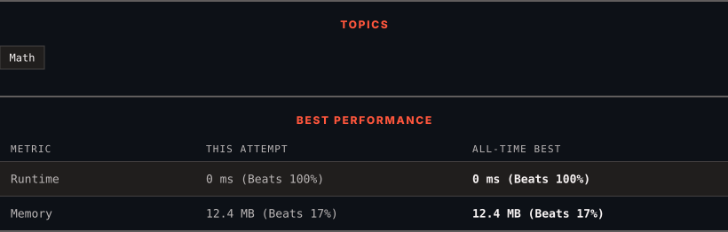

<div align="center">

# 1281. Subtract the Product and Sum of Digits of an Integer

      

[](https://leetcode.com/problems/subtract-the-product-and-sum-of-digits-of-an-integer/)

</div>

---

<div align="center">

<picture>
  <source media="(prefers-color-scheme: dark)" srcset="panel-dark.svg">
  <source media="(prefers-color-scheme: light)" srcset="panel-light.svg">
  
</picture>

</div>

> **New personal best** — Runtime improved on this submission.

### HOW IT WENT

| | |
|:--|:--|
| **Attempts** | first try |
| **Time to solve** | 4 min |
| **Verdicts** | ✅ Accepted |

---

### NOTES

_No notes yet._

---

### SOLUTIONS (1)

| # | File | Language | Date |
|:-:|------|:--------:|:----:|
| 1 | [sol1.py](./sol1.py) | `Python` | 2026-09-18 ← **latest** |

---

### PROBLEM DESCRIPTION

Given an integer number `n`, return the difference between the product of its digits and the sum of its digits.
 

**Example 1:**

```

**Input:** n = 234
**Output:** 15 
**Explanation:** 
Product of digits = 2 * 3 * 4 = 24 
Sum of digits = 2 + 3 + 4 = 9 
Result = 24 - 9 = 15

```

**Example 2:**

```

**Input:** n = 4421
**Output:** 21
**Explanation: 
**Product of digits = 4 * 4 * 2 * 1 = 32 
Sum of digits = 4 + 4 + 2 + 1 = 11 
Result = 32 - 11 = 21

```

 

**Constraints:**

	- `1 <= n <= 10^5`

---

<div align="center">

<sub>Auto-synced by <strong>LeetSync</strong> · Built by <a href="https://deveshsamant.in/">Devesh Samant</a></sub>

</div>
