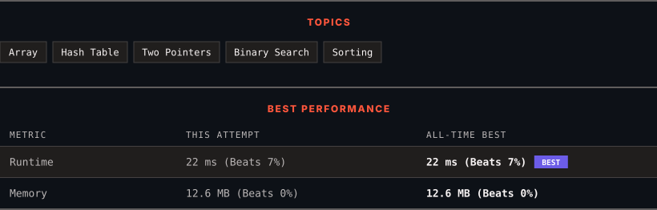

<div align="center">

# 1346. Check If N and Its Double Exist

      

[](https://leetcode.com/problems/check-if-n-and-its-double-exist/)

</div>

---

<div align="center">

<picture>
  <source media="(prefers-color-scheme: dark)" srcset="panel-dark.svg">
  <source media="(prefers-color-scheme: light)" srcset="panel-light.svg">
  
</picture>

</div>

> **New personal best** — Runtime improved on this submission.

### HOW IT WENT

| | |
|:--|:--|
| **Attempts** | 2 before accepted |
| **Time to solve** | 5 min |
| **Verdicts** | ❌ Wrong Answer → ✅ Accepted |

---

### NOTES

_No notes yet._

---

### SOLUTIONS (1)

| # | File | Language | Date |
|:-:|------|:--------:|:----:|
| 1 | [sol1.py](./sol1.py) | `Python` | 2026-09-28 ← **latest** |

---

### PROBLEM DESCRIPTION

Given an array `arr` of integers, check if there exist two indices `i` and `j` such that :

	- `i != j`

	- `0 <= i, j < arr.length`

	- `arr[i] == 2 * arr[j]`

 

**Example 1:**

```

**Input:** arr = [10,2,5,3]
**Output:** true
**Explanation:** For i = 0 and j = 2, arr[i] == 10 == 2 * 5 == 2 * arr[j]

```

**Example 2:**

```

**Input:** arr = [3,1,7,11]
**Output:** false
**Explanation:** There is no i and j that satisfy the conditions.

```

 

**Constraints:**

	- `2 <= arr.length <= 500`

	- `-10^3 <= arr[i] <= 10^3`

---

<div align="center">

<sub>Auto-synced by <strong>LeetSync</strong> · Built by <a href="https://deveshsamant.in/">Devesh Samant</a></sub>

</div>
