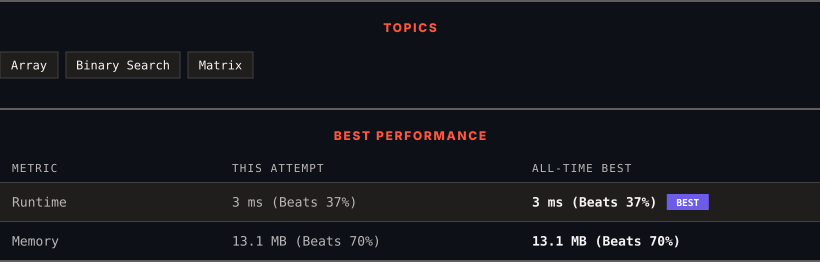

<div align="center">

# 1351. Count Negative Numbers in a Sorted Matrix

      

[](https://leetcode.com/problems/count-negative-numbers-in-a-sorted-matrix/)

</div>

---

<div align="center">

<picture>
  <source media="(prefers-color-scheme: dark)" srcset="panel-dark.svg">
  <source media="(prefers-color-scheme: light)" srcset="panel-light.svg">
  
</picture>

</div>

> **New personal best** — Runtime improved on this submission.

### HOW IT WENT

| | |
|:--|:--|
| **Attempts** | first try |
| **Time to solve** | 3 min |
| **Verdicts** | ✅ Accepted |

---

### NOTES

_No notes yet._

---

### SOLUTIONS (1)

| # | File | Language | Date |
|:-:|------|:--------:|:----:|
| 1 | [sol1.py](./sol1.py) | `Python` | 2026-09-27 ← **latest** |

---

### PROBLEM DESCRIPTION

Given a `m x n` matrix `grid` which is sorted in non-increasing order both row-wise and column-wise, return *the number of **negative** numbers in* `grid`.

 

**Example 1:**

```

**Input:** grid = [[4,3,2,-1],[3,2,1,-1],[1,1,-1,-2],[-1,-1,-2,-3]]
**Output:** 8
**Explanation:** There are 8 negatives number in the matrix.

```

**Example 2:**

```

**Input:** grid = [[3,2],[1,0]]
**Output:** 0

```

 

**Constraints:**

	- `m == grid.length`

	- `n == grid[i].length`

	- `1 <= m, n <= 100`

	- `-100 <= grid[i][j] <= 100`

 

**Follow up:** Could you find an `O(n + m)` solution?

---

<div align="center">

<sub>Auto-synced by <strong>LeetSync</strong> · Built by <a href="https://deveshsamant.in/">Devesh Samant</a></sub>

</div>
