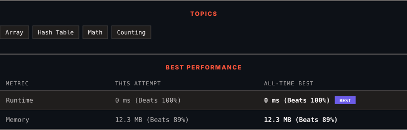

<div align="center">

# 1512. Number of Good Pairs

      

[](https://leetcode.com/problems/number-of-good-pairs/)

</div>

---

<div align="center">

<picture>
  <source media="(prefers-color-scheme: dark)" srcset="panel-dark.svg">
  <source media="(prefers-color-scheme: light)" srcset="panel-light.svg">
  
</picture>

</div>

> **New personal best** — Runtime improved on this submission.

### HOW IT WENT

| | |
|:--|:--|
| **Attempts** | first try |
| **Time to solve** | 5 min |
| **Verdicts** | ✅ Accepted |

---

### NOTES

_No notes yet._

---

### SOLUTIONS (1)

| # | File | Language | Date |
|:-:|------|:--------:|:----:|
| 1 | [sol1.py](./sol1.py) | `Python` | 2026-09-18 ← **latest** |

---

### PROBLEM DESCRIPTION

Given an array of integers `nums`, return *the number of **good pairs***.

A pair `(i, j)` is called *good* if `nums[i] == nums[j]` and `i` < `j`.

 

**Example 1:**

```

**Input:** nums = [1,2,3,1,1,3]
**Output:** 4
**Explanation:** There are 4 good pairs (0,3), (0,4), (3,4), (2,5) 0-indexed.

```

**Example 2:**

```

**Input:** nums = [1,1,1,1]
**Output:** 6
**Explanation:** Each pair in the array are *good*.

```

**Example 3:**

```

**Input:** nums = [1,2,3]
**Output:** 0

```

 

**Constraints:**

	- `1 <= nums.length <= 100`

	- `1 <= nums[i] <= 100`

---

<div align="center">

<sub>Auto-synced by <strong>LeetSync</strong> · Built by <a href="https://deveshsamant.in/">Devesh Samant</a></sub>

</div>
