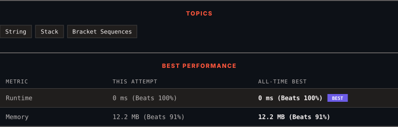

# 1614. Maximum Nesting Depth of the Parentheses

      

---

<picture>
  <source media="(prefers-color-scheme: dark)" srcset="panel-dark.svg">
  <source media="(prefers-color-scheme: light)" srcset="panel-light.svg">
  
</picture>

> **New personal best** — Runtime improved on this submission.

### HOW IT WENT

| | |
|:--|:--|
| **Attempts** | first try |
| **Time to solve** | 7 min |
| **Verdicts** | ✅ Accepted |

---

### NOTES

_No notes yet._

---

### SOLUTIONS (1)

| # | File | Language | Date |
|:-:|------|:--------:|:----:|
| 1 | [sol1.py](./sol1.py) | `Python` | 2026-09-28 ← **latest** |

---

### PROBLEM DESCRIPTION

Given a **valid parentheses string** `s`, return the **nesting depth** of* *`s`. The nesting depth is the **maximum** number of nested parentheses.

 

**Example 1:**

**Input:** s = "(1+(2*3)+((8)/4))+1"

**Output:** 3

**Explanation:**

Digit 8 is inside of 3 nested parentheses in the string.

**Example 2:**

**Input:** s = "(1)+((2))+(((3)))"

**Output:** 3

**Explanation:**

Digit 3 is inside of 3 nested parentheses in the string.

**Example 3:**

**Input:** s = "()(())((()()))"

**Output:** 3

 

**Constraints:**

	- `1 <= s.length <= 100`

	- `s` consists of digits `0-9` and characters `'+'`, `'-'`, `'*'`, `'/'`, `'('`, and `')'`.

	- It is guaranteed that parentheses expression `s` is a VPS.

---

Auto-synced by <strong>LeetSync</strong> · Built by <a href="https://deveshsamant.in/">Devesh Samant</a>

