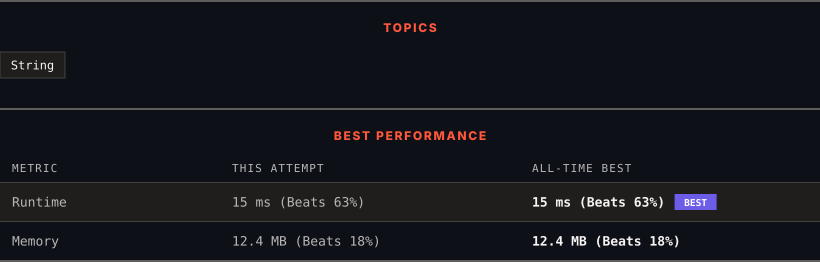

<div align="center">

# 1678. Goal Parser Interpretation

      

[](https://leetcode.com/problems/goal-parser-interpretation/)

</div>

---

<div align="center">

<picture>
  <source media="(prefers-color-scheme: dark)" srcset="panel-dark.svg">
  <source media="(prefers-color-scheme: light)" srcset="panel-light.svg">
  
</picture>

</div>

> **New personal best** — Runtime improved on this submission.

### HOW IT WENT

| | |
|:--|:--|
| **Attempts** | first try |
| **Time to solve** | 56 min |
| **Verdicts** | ✅ Accepted |

---

### NOTES

_No notes yet._

---

### SOLUTIONS (1)

| # | File | Language | Date |
|:-:|------|:--------:|:----:|
| 1 | [sol1.py](./sol1.py) | `Python` | 2026-09-18 ← **latest** |

---

### PROBLEM DESCRIPTION

You own a **Goal Parser** that can interpret a string `command`. The `command` consists of an alphabet of `"G"`, `"()"` and/or `"(al)"` in some order. The Goal Parser will interpret `"G"` as the string `"G"`, `"()"` as the string `"o"`, and `"(al)"` as the string `"al"`. The interpreted strings are then concatenated in the original order.

Given the string `command`, return *the **Goal Parser**'s interpretation of *`command`.

 

**Example 1:**

```

**Input:** command = "G()(al)"
**Output:** "Goal"
**Explanation:** The Goal Parser interprets the command as follows:
G -> G
() -> o
(al) -> al
The final concatenated result is "Goal".

```

**Example 2:**

```

**Input:** command = "G()()()()(al)"
**Output:** "Gooooal"

```

**Example 3:**

```

**Input:** command = "(al)G(al)()()G"
**Output:** "alGalooG"

```

 

**Constraints:**

	- `1 <= command.length <= 100`

	- `command` consists of `"G"`, `"()"`, and/or `"(al)"` in some order.

---

<div align="center">

<sub>Auto-synced by <strong>LeetSync</strong> · Built by <a href="https://deveshsamant.in/">Devesh Samant</a></sub>

</div>
