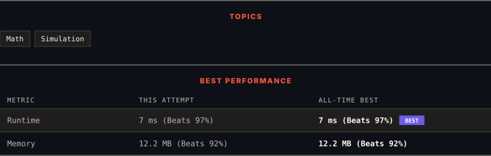

<div align="center">

# 1688. Count of Matches in Tournament

      

[](https://leetcode.com/problems/count-of-matches-in-tournament/)

</div>

---

<div align="center">

<picture>
  <source media="(prefers-color-scheme: dark)" srcset="panel-dark.svg">
  <source media="(prefers-color-scheme: light)" srcset="panel-light.svg">
  
</picture>

</div>

> **New personal best** — Runtime improved on this submission.

### HOW IT WENT

| | |
|:--|:--|
| **Attempts** | first try |
| **Time to solve** | 1 min |
| **Verdicts** | ✅ Accepted |

---

### NOTES

_No notes yet._

---

### SOLUTIONS (1)

| # | File | Language | Date |
|:-:|------|:--------:|:----:|
| 1 | [sol1.py](./sol1.py) | `Python` | 2026-09-30 ← **latest** |

---

### PROBLEM DESCRIPTION

You are given an integer `n`, the number of teams in a tournament that has strange rules:

	- If the current number of teams is **even**, each team gets paired with another team. A total of `n / 2` matches are played, and `n / 2` teams advance to the next round.

	- If the current number of teams is **odd**, one team randomly advances in the tournament, and the rest gets paired. A total of `(n - 1) / 2` matches are played, and `(n - 1) / 2 + 1` teams advance to the next round.

Return *the number of matches played in the tournament until a winner is decided.*

 

**Example 1:**

```

**Input:** n = 7
**Output:** 6
**Explanation:** Details of the tournament: 
- 1st Round: Teams = 7, Matches = 3, and 4 teams advance.
- 2nd Round: Teams = 4, Matches = 2, and 2 teams advance.
- 3rd Round: Teams = 2, Matches = 1, and 1 team is declared the winner.
Total number of matches = 3 + 2 + 1 = 6.

```

**Example 2:**

```

**Input:** n = 14
**Output:** 13
**Explanation:** Details of the tournament:
- 1st Round: Teams = 14, Matches = 7, and 7 teams advance.
- 2nd Round: Teams = 7, Matches = 3, and 4 teams advance.
- 3rd Round: Teams = 4, Matches = 2, and 2 teams advance.
- 4th Round: Teams = 2, Matches = 1, and 1 team is declared the winner.
Total number of matches = 7 + 3 + 2 + 1 = 13.

```

 

**Constraints:**

	- `1 <= n <= 200`

---

<div align="center">

<sub>Auto-synced by <strong>LeetSync</strong> · Built by <a href="https://deveshsamant.in/">Devesh Samant</a></sub>

</div>
