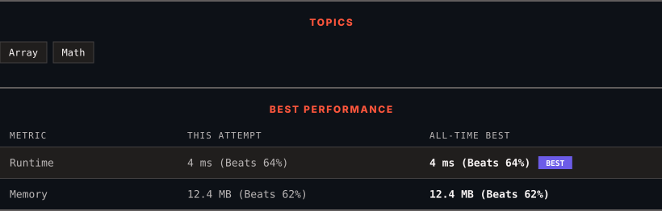

# 3550. Smallest Index With Digit Sum Equal to Index

      

---

<picture>
  <source media="(prefers-color-scheme: dark)" srcset="panel-dark.svg">
  <source media="(prefers-color-scheme: light)" srcset="panel-light.svg">
  
</picture>

> **New personal best** — Runtime improved on this submission.

### HOW IT WENT

| | |
|:--|:--|
| **Attempts** | first try |
| **Time to solve** | 7 min |
| **Verdicts** | ✅ Accepted |

---

### NOTES

_No notes yet._

---

### SOLUTIONS (1)

| # | File | Language | Date |
|:-:|------|:--------:|:----:|
| 1 | [sol1.py](./sol1.py) | `Python` | 2026-09-24 ← **latest** |

---

### PROBLEM DESCRIPTION

You are given an integer array `nums`.

Return the **smallest** index `i` such that the sum of the digits of `nums[i]` is equal to `i`.

If no such index exists, return `-1`.

 

**Example 1:**

**Input:** nums = [1,3,2]

**Output:** 2

**Explanation:**

	- For `nums[2] = 2`, the sum of digits is 2, which is equal to index `i = 2`. Thus, the output is 2.

**Example 2:**

**Input:** nums = [1,10,11]

**Output:** 1

**Explanation:**

	- For `nums[1] = 10`, the sum of digits is `1 + 0 = 1`, which is equal to index `i = 1`.

	- For `nums[2] = 11`, the sum of digits is `1 + 1 = 2`, which is equal to index `i = 2`.

	- Since index 1 is the smallest, the output is 1.

**Example 3:**

**Input:** nums = [1,2,3]

**Output:** -1

**Explanation:**

	- Since no index satisfies the condition, the output is -1.

 

**Constraints:**

	- `1 <= nums.length <= 100`

	- `0 <= nums[i] <= 1000`

---

Auto-synced by <strong>LeetSync</strong> · Built by <a href="https://deveshsamant.in/">Devesh Samant</a>

