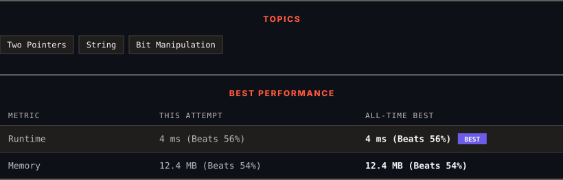

# 4030. Check ASCII Palindromic

      

---

<picture>
  <source media="(prefers-color-scheme: dark)" srcset="panel-dark.svg">
  <source media="(prefers-color-scheme: light)" srcset="panel-light.svg">
  
</picture>

> **New personal best** — Runtime improved on this submission.

### HOW IT WENT

| | |
|:--|:--|
| **Attempts** | first try |
| **Time to solve** | 4 min |
| **Verdicts** | ✅ Accepted |

---

### NOTES

_No notes yet._

---

### SOLUTIONS (1)

| # | File | Language | Date |
|:-:|------|:--------:|:----:|
| 1 | [sol1.py](./sol1.py) | `Python` | 2026-09-29 ← **latest** |

---

### PROBLEM DESCRIPTION

You are given a string `s` consisting of lowercase English letters.

Construct a **binary string** by replacing each character in `s` with the 8-bit binary representation of its ASCII value, **including leading zeros**, while preserving the original order of the characters.

Return `true` if the resulting binary string is a **palindrome**. Otherwise, return `false`.

 

**Example 1:**

**Input:** s = "ff"

**Output:** true

**Explanation:**

	- The ASCII value of `f` is 102, whose 8-bit binary representation is `01100110`.

	- Thus, the binary string is `0110011001100110`.

	- Since this binary string is a **palindrome**, the output is `true`.

**Example 2:**

**Input:** s = "leet"

**Output:** false

**Explanation:**

	- The ASCII values of `l`, `e`, `e`, and `t` are 108, 101, 101, and 116, respectively.

	- Their 8-bit binary representations are `01101100`, `01100101`, `01100101`, and `01110100`.

	- Thus, the binary string is `01101100011001010110010101110100`.

	- Since this binary string is not a **palindrome**, the output is `false`.

 

**Constraints:**

	- `1 <= s.length <= 100`

	- `s` consists of lowercase English letters.

---

Auto-synced by <strong>LeetSync</strong> · Built by <a href="https://deveshsamant.in/">Devesh Samant</a>

